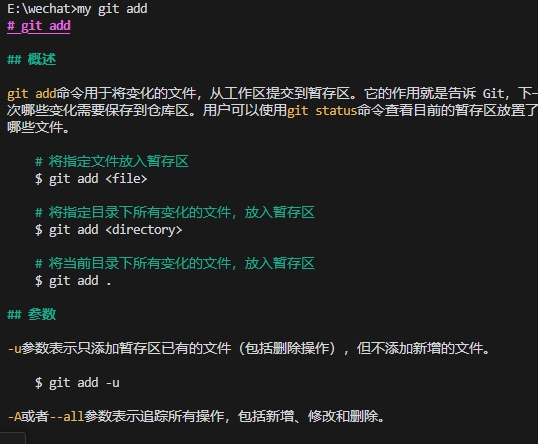
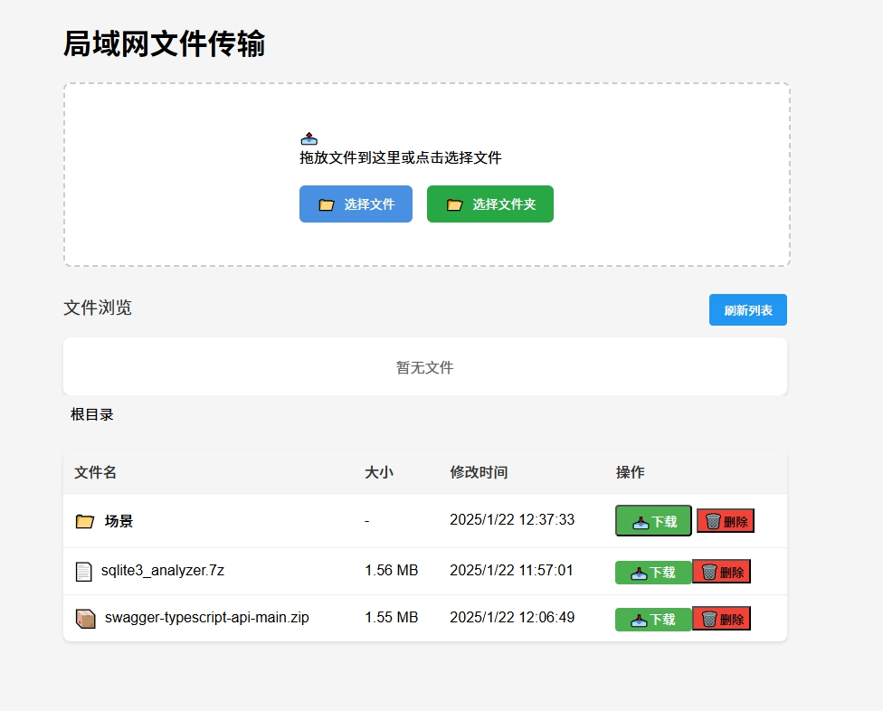
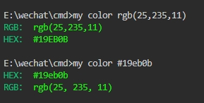

# hudada-cli 命令行工具

一个功能强大的命令行工具集，集成了本地文档搜索,文件操作、局域网文件传输、ssh终端操作,ai对话,快捷打开网页等多种实用功能。


## 目录
- [安装](#安装)
- [功能特性](#功能特性)
  - [文件搜索服务](#文件搜索服务)
  - [翻译功能](#翻译功能)
  - [AI对话](#AI对话)
  - [文件传输服务](#文件传输服务)
  - [ssh服务器登录,服务器文件上传下载](#ssh服务器登录,服务器文件上传下载)
  - [网络搜索,打开网页](#网络搜索,打开网页)
  - [一般系统操作](#一般系统操作)
  - [获取随机资源](#获取随机资源)
  - [图片处理](#图片处理)
  - [字符串处理](#字符串处理)
 
## 安装

`npm i hudada-cli -g`

需要全局安装,在命令行中输入`my -h`即可查看帮助

⚡️ 安装特别简单：
```bash
npm install hudada-cli -g --registry=https://registry.npmmirror.com 
```

注意: 安装包里包含了抠图的模型文件,比较大,请耐心下载安装

如果安装不成功,(因为使用了sharp插件),安装失败的概率还是比较大的,可以尝试在命令行中输入 `npm i hudada-cli -g --registry=https://registry.npmmirror.com --force`
进行强制安装


🎯 装完直接输入 `my -h` 就能看到所有命令。整个工具是用 TypeScript 开发的，支持 Windows/Mac/Linux，代码完全开源。以后如果有一些人使用,我会好好维护这个项目.

📦 项目地址：https://github.com/hudada-hub/hudada-tool

🌟 如果觉得有用，欢迎试用和提建议！


## 功能特性


### 文件搜索服务

作为一个记性差的程序员，你是否经常忘记各种命令，比如git,docker,还有linux下的各种命令，比如tar的解压和压缩，如果忘了，就需要打开百度.com，在各种网页中搜索，非常难受。

不仅是各种命令，还有各种账号呀，自己私密的东西，想要查看还需要每次都打开文件，再查看，非常繁琐，现在你只需要打开cmd,输入my git add就可以了解git add的各种用法，my linux tar就可以了解tar的用法

my cli中,内置了一些常用的文档,比如git,docker,linux,python


原理是输入 `my git add`命令,则会在data文件夹中,在git文件夹中查找add.md文档,然后将文档渲染到命令行中.



在比如你想知道 linux中tar命令的用法,只需要输入 `my linux tar` 就可以在命令行中看到tar命令的用法


思考一个场景,你有一个私密文档,比如你将你平时记录的笔记,或者一些账号密码,或者一些网址文件,这些文件存在本地的某个目录下,如果你想搜索这些文件的一些关键信息,比如关键字`图片`

只需要这些步骤:
1. 输入 `my -d C:\Users\Administrator\Desktop\testdoc` 将本地的自己的文件夹附加进去,以后每次搜索都会进入这个文件夹下搜索,


2. 输入`my deo-web` 即可获取文档内容


3. 输入`my deo-web -s 图片` 即可搜索deo-web文档中关键字 `图片`,对搜索出的文档关键字进行高亮标注

4. 假如你的文档中有图片文件,比如

输入`my demoimg` 即可打开图片


5. 假如你想对你的文档文件,想添加一些内容,比如你在网上看到一个好的网站,输入`my deo-web -a 胡大大工具 https://github.com/hudada-hub/hudada-tool` 即可追加文档内容


6. 如果你想查看子目录下的文件,比如

输入`my 目录 文本文件` 即可查看目录下的文本文件

7. 如果你不想再刚才添加的`C:\Users\Administrator\Desktop\testdoc`目录下查找
输入`my -r C:\Users\Administrator\Desktop\testdoc ` 即可移除该目录.

输入`my -l` 即可查看所有附加的目录


### 翻译功能


自动检测中英文:
`my t 你好世界`
```
原文: 你好世界
译文: Hello world
```

`my t this is one good tool`

```
原文: this is one good tool
译文: 这是一个很好的工具
```


如果想要翻译成其他语言,可以输入`my t this is one good tool --to jp`

```
原文: this is one good tool
译文: これは良いツールです。
```


### AI对话

使用deepseek的ai对话功能,可以直接输入`my ai`即可,输入`my ai 给我生成一个vue页面`即可进行对话


命令行关于AI方面的使用方法:
1. AI对话,历史记忆功能,使用`my ai clear`可以清除历史记忆
2. AI对话模板选择,使用`my ai list`可以查看模板列表,使用`my ai add`可以添加自定义模板
3. AI对话文件读取,使用`my ai read`可以读取文件内容,使用`my ai read <文件路径>`可以读取指定文件内容,然后通过内容,来进行AI对话
4. AI对话保存回复,使用`my ai save`可以保存AI对话到文件,使用`my ai -save <文件路径>`可以保存AI对话到指定文件
5. AI配置,使用`my ai key`可以配置AI的key,我使用的是deepseek的api,需要你自己申请key来配置,来使用这个ai对话功能

### ssh服务器登录,服务器文件上传下载

输入`my ssh` 会打开一个本地的浏览器页面,可以登录ssh服务器.服务器账号密码信息,存储在本地的`localStorage`中


1. 可以拖入文件到终端中,可以实现上传文件功能


2. 对文件右键选取,然后会出现下载按钮,点击可以下载服务器文件到本地


### 文件传输服务
- `my local [port]` - 启动本地文件传输服务,适合大部分公司内部局域网传输;
 将在本地命令行所在的文件夹创建一个`uploads`文件夹,上传的文件都保存到该文件夹下


- 可以上传文件夹
- 可以下载文件夹,自动保存为zip格式
- 可以删除文件
- 可以下载文件
- 可以拖动文件上传
- 可以进入子文件夹


### 网络搜索,打开网页

- `my github <keyword>` - GitHub 搜索
- `my baidu <keyword>` - 百度搜索
- `my bug <keyword>` - Stack Overflow 搜索
- `my bili <keyword>` - B站搜索
- `my juejin <keyword>` - 掘金搜索
- `my zhihu <keyword>` - 知乎搜索
- `my mdn <keyword>` - MDN 文档搜索
- `my csdn <keyword>` - CSDN 搜索
- `my npm <keyword>` - NPM 包搜索
- `my google <keyword>` - Google 搜索
- `my bing <keyword>` - Bing 搜索
- `my s <keyword>` - 在一次性打开所有平台搜索

- `my http <url>` - 在浏览器中打开指定 URL
- `my httpp <url>` - 浏览器隐私模式,在浏览器中打开指定 URL


### 一般系统操作

- `my dns <domain>` - DNS 查询


- `my os` - 显示系统信息


- `my kill <port>` - 结束指定端口的进程
- `my host list` - hosts 文件内容查看

- `my host add 127.0.0.1 example.com` 添加 hosts 记录
- `my host remove example.com` 删除 hosts 记录
- `my path list|add|remove <path>` - 环境路径管理

###  文件操作,命令行参考linux的文件命令

- `my ls` -  格式化列出当前目录内容,并自动计算文件夹的总大小


- `my rm <path>` - 删除文件或目录
- `my touch <file>` - 创建文件
- `my mkdir <path>` - 创建目录
- `my cp <source> <destination>` - 复制文件或目录
- `my mv <source> <destination>` - 移动文件或目录
- `my zip <file> <archive>` - 压缩文件或目录
- `my unzip <archive>` - 解压缩文件
- `my find ` - 查找文件或目录

demo:
```bash
my find -size=">2MB" type=f //表示查找大于2MB的文件,type=f表示查找文件

```


-

### 获取随机资源

- `my mp3` - 返回10个随机的mp3歌曲


- `my png` - 返回10个随机的png图片


### 图片处理
- `my koutu` - 图片抠图


- `my imgp` - 图片压缩


### 字符串处理
- `my date` - 时间戳工具

- `my color <rgb|hex>` - 颜色工具



- `my md5 <text>` - md5加密
- `my base64 文件路径` - base64加密
将http路径下的文件进行base64


对本地文件进行base64


- `my comment`,随机生成类似佛祖保佑的代码注释
- `my cleannode`,循环遍历当前文件夹及子文件夹,默认清除所有`node_modules`文件夹,如果使用`my cleannode 文件夹名称`,则清除指定文件夹
- `my install`,循环遍历当前文件夹以及子文件夹,检测是否有`package.json`文件,如果有,则使用`npm install`安装依赖


